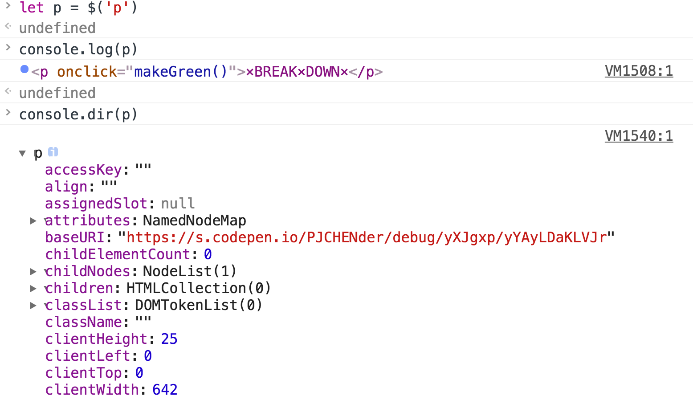
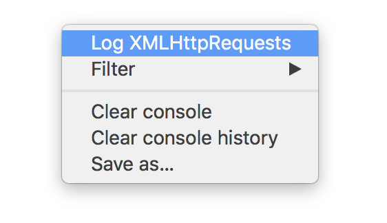
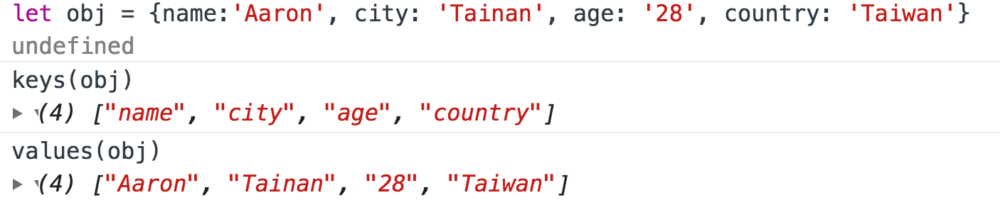

# Chrome develope

參考: <https://pjchender.blogspot.tw/2017/06/chrome-dev-tools.html>

## 基本 console 使用

1. 監聽事件

     ```js
     monitorEvents(element [,event])     //    監聽某一元素
     unmonitorEvents(element [,event])   //    取消監聽某一元素 
     getEventListeners(element)          //    查看某一元素綁定了哪些事件
     ```

1. 檢視 HTML 元素
    * 使用 `console.dir(<HTMLElement>)` 可以幫助我們檢視這個 DOM 元素中的所有屬性：
     

1. 檢視 AJAX Request
    * 在 console 視窗中點右鍵，勾選 “Log XMLHTTPRequest” 就可以看到該網站所發出的 AJAX request：
     
1. 讓瀏覽器可以直接編輯網頁
    * 在 console 中輸入

     ```js
     document.designMode = 'on'
     ```

1. 改變 console.log的樣式
    * 我們可以在 console.log() 的函式中使用 %c，後面再放入 CSS 樣式，就可以改變 console.log 輸出的文字樣式：

     ```js
     console.log('%c What a Cool Console', 'font-size: 32px; color: red')
     ```

### 查看物件

1. 在 console 中我們可以使用 keys(obj) 和 values(obj) 來取的物件的鍵和值：
    * 

### Debug

1. 將某函式進入 debug 模式 / 將某函式退出 debug 模式

     ```js
     debug(function)
     undebug(function)
     ```

1. 監聽某一函式，會回傳函式名稱和使用的參數

     ```js
     monitor(fn)
     ```