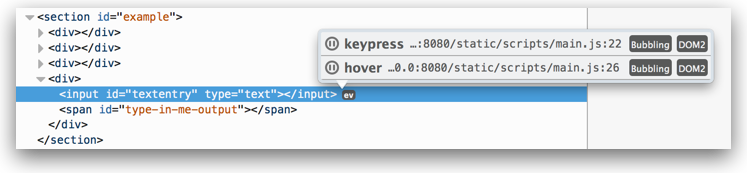

# Firefox 開發者工具

ref: [MDN](https://developer.mozilla.org/zh-TW/docs/Tools)

## Page Insepector (頁面檢測器)

1. 鍵盤快捷鍵: [FireFox](https://developer.mozilla.org/zh-CN/docs/Tools/Keyboard_shortcuts)
    1. `Ctrl shift C`: 打開 select element in the page to inspect it
    1. `Ctrl U`: 檢視原始碼 (有時候整個網頁都是圖片的時候，好用)

### HTML Pane

1. HTML Breadcrumbs(麵包屑): 觀察 DOM structure 的結構
1. Search box: 搜尋(過濾)器
1. HTML tree
1. ::before and ::after: inspect pseudo-elements added using `::before` and `::after`
    1. css3的定義(進階技巧)，`::before`, `::after`定義 偽元素
    1. `::before`: 在元素之後插入某些內容
    1. `::after`: 在元素之前插入某些內容
    * ref: [你所不知的 CSS ::before 和 ::after 偽元素用法](http://blog.dimpurr.com/css-before-after/)
1. Element popup menu(在elements上面按右鍵):
    1. Edit as HTML
    1. Copy Inner HTML
    1. Copy Outer HTML
    1. Copy Unique Selector
    1. Copy Image DataUTL
    1. __Show DOM properties__: 開啟 Web Console，輸入 `Inspect($0)`，可以在console中拿到所選的元素
    1. Paste Outer HTML
    1. Delete Node: 刪除元素
    1. `:hover`: 設定 `:hover` CSS 的偽類(pseudo-class)
    1. `:active`: 設定 `:active` CSS 的偽類(pseudo-class)
    1. `:focus`: 設定 `:focus` CSS 的偽類(pseudo-class)
1. Examining event listeners:
    1. 在 Firefox 33的版本，會到看 "ev" 的按鈕在 elements後面，點開，會看到與這個元素相關的 event listener在裡，其中每一行包含:
    
        1. 事件的名稱
        1. the name and line number for the listener: click this to see the listener function in the popup
        1. a pause button: click that to go to the event listener in the Debugger, where you'll be able to set a breakpoint in it
        1. an indication of whether the event bubbles and which DOM specification defines it
    1. 在 Firefox 34的版本，甚至會顯示 jQuery events

### CSS pane

ref: [MDN #CSS_pane](https://developer.mozilla.org/zh-TW/docs/Tools/Page_Inspector#CSS_pane)

## Web Console (網路主控台)

1. 紀錄網頁相關的資訊
    1. network requests (網路請求)
    1. JavaScript
    1. security errors,  warnings and error
    1. 頁面運行的 JavaScript 相關問題
1. 透過執行頁面中的 JavaScript 表達式與網頁互動

### 打開網頁主控台(console)

如何開始使用網頁主控台，分成三個區塊(上、中、下)

1. Toolbar
    1. 可以觀察個別的程式碼分類，常見的有 Net ( Errors, Warnings, XHR, Log ), Css( Errors, Warnings, Reflows), JS( Errors, Warnings), Sercurity( Errors, Warnings), Logging(Errors, Warnings, Info, Log, Shared Workers, Service Workers, Add-on or Chrome Workers), Server( Errors, Warnings, Info, Log)
    1. 過濾器 ( Filtering by text)
    1. 清除 LOG
1. Command Line
1. message Display Pane

### 主控台訊息

主控台相關的紀錄訊息。

[The command line interpreter](https://developer.mozilla.org/en-US/docs/Tools/Web_Console/The_command_line_interpreter#Helper_commands)

### 命令行解釋器

如何用主控台與文件互動。

1. Helper commands
    1. `$()`: 等同 `document.querySelector()`
    1. `$$()`: 等同 `document.querySelectorAll()`
    1. `$0`: 顯示在這頁選擇到的 element
    1. `$_`
    1. `$x()`
    1. `keys()`: 給定一個物件，會返回這個物件裡面所有的keys
    1. `values()`
    1. `clear()`
    1. `inspect()`: 給一個物件，會打開這個物件裡面的東西
    1. `pprint()`: Formats the specified value in a readable way; this is useful for dumping the contents of objects and arrays.
    1. `help()`
    1. `cd()`: 如果頁面嵌入 `iframe`，可以用 `cd()` 改變 `console` 的scope，變成指定的 iframe，這樣就可以執行定義在 iframe裡面的函數。
        1. Switch JavaScript evaluation context to a different iframe in the page.
        1. [Working with iframes](https://developer.mozilla.org/en-US/docs/Tools/Working_with_iframes)
    1. `copy()`: 會複製 `outerHTML`的內容
        1. `JSON.stringify()`: 一個特殊的方法，可以將值轉變為 JSON 的字串，參考 [JSON.stringify()](https://developer.mozilla.org/en-US/docs/Web/JavaScript/Reference/Global_Objects/JSON/stringify)
    1. `clearHistory()`: 可以清除之前輸入過的指令(按 方向鍵上 會出現的指令)

### 輸出對象

### 分割主控台

### 鍵盤快速鍵

## JavaScript Debugger (JavaScript 除錯器)

## Network Monitor (網路監控)

## Performance Tools (效能工具)

## Responsive Design Mode (適應性設計模式)
