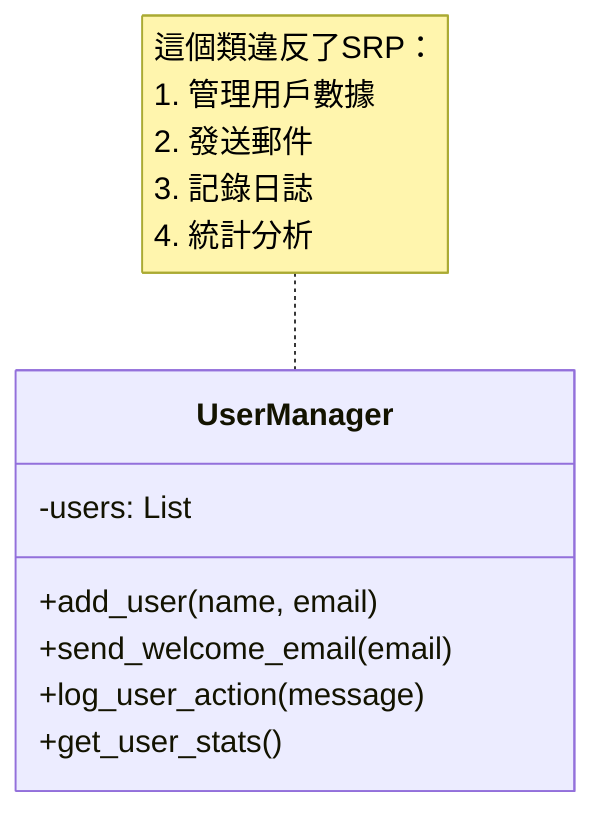
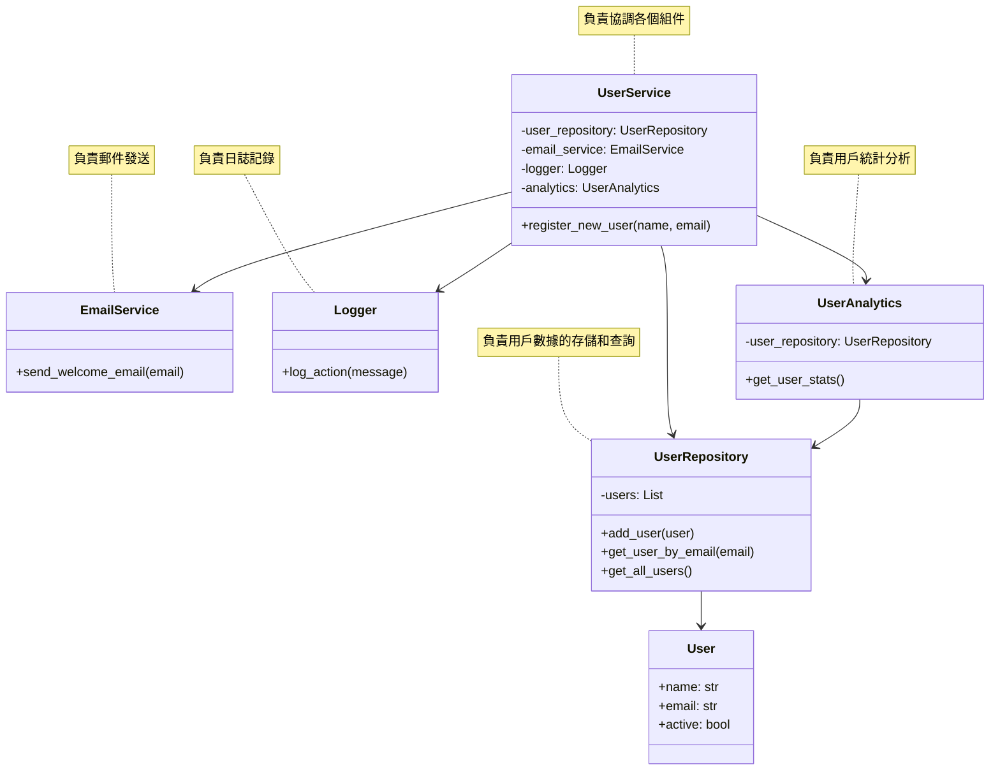

# Single-responsibility principle (SRP)

按照慣例，先上定義：“A class should have only one reason to change.”
翻譯成中文是：「一個模組應有且只有一個理由會使其改變。」

單一職責原則的定義：
   - 一個類應該只有一個引起它變化的原因
   - 每個類應該只負責一件事情
   - 把不同的職責分散到不同的類中


## 違反 SRP 的問題

```python
class UserManager:
    def __init__(self):
        self.users = []

    def add_user(self, name, email):
        # 處理用戶數據
        user = {"name": name, "email": email}
        self.users.append(user)
        
        # 發送歡迎郵件
        self.send_welcome_email(email)
        
        # 寫入日誌
        self.log_user_action(f"Added new user: {name}")
        
    def send_welcome_email(self, email):
        # 發送郵件的邏輯混合在用戶管理類中
        email_content = "Welcome to our platform!"
        print(f"Sending email to {email}: {email_content}")
        
    def log_user_action(self, message):
        # 日誌記錄邏輯混合在用戶管理類中
        print(f"Log: {message} at {datetime.now()}")
        
    def get_user_stats(self):
        # 統計分析邏輯混合在用戶管理類中
        return {
            "total_users": len(self.users),
            "active_users": len([u for u in self.users if u.get("active", False)])
        }
```

- 原始的 `UserManager` 類承擔了多個職責：
  - 用戶數據管理
  - 郵件發送
  - 日誌記錄
  - 數據統計
- 這樣的設計會導致：
  - 代碼難以維護
  - 修改一個功能可能影響其他功能
  - 難以測試
  - 代碼重用性差



## 遵循 SRP 的改進

```python
class User:
    def __init__(self, name, email):
        self.name = name
        self.email = email
        self.active = True

class UserRepository:
    def __init__(self):
        self.users = []
    
    def add_user(self, user):
        """只負責用戶數據的存儲"""
        self.users.append(user)
    
    def get_user_by_email(self, email):
        """只負責用戶數據的查詢"""
        return next((user for user in self.users if user.email == email), None)
    
    def get_all_users(self):
        """只負責用戶數據的查詢"""
        return self.users.copy()

class EmailService:
    @staticmethod
    def send_welcome_email(email):
        """只負責發送郵件"""
        email_content = "Welcome to our platform!"
        print(f"Sending email to {email}: {email_content}")

class Logger:
    @staticmethod
    def log_action(message):
        """只負責日誌記錄"""
        print(f"Log: {message} at {datetime.now()}")

class UserAnalytics:
    def __init__(self, user_repository):
        self.user_repository = user_repository
    
    def get_user_stats(self):
        """只負責用戶統計分析"""
        users = self.user_repository.get_all_users()
        return {
            "total_users": len(users),
            "active_users": len([u for u in users if u.active])
        }

class UserService:
    def __init__(self, user_repository, email_service, logger, analytics):
        self.user_repository = user_repository
        self.email_service = email_service
        self.logger = logger
        self.analytics = analytics
    
    def register_new_user(self, name, email):
        """協調各個組件完成用戶註冊流程"""
        # 創建用戶
        user = User(name, email)
        
        # 存儲用戶
        self.user_repository.add_user(user)
        
        # 發送歡迎郵件
        self.email_service.send_welcome_email(email)
        
        # 記錄日誌
        self.logger.log_action(f"Added new user: {name}")
        
        return user

# 使用示例
def main():
    # 初始化各個組件
    user_repository = UserRepository()
    email_service = EmailService()
    logger = Logger()
    analytics = UserAnalytics(user_repository)
    
    # 創建用戶服務
    user_service = UserService(user_repository, email_service, logger, analytics)
    
    # 註冊新用戶
    user_service.register_new_user("John Doe", "john@example.com")
    
    # 獲取統計資料
    stats = analytics.get_user_stats()
    print(f"User statistics: {stats}")

if __name__ == "__main__":
    main()
```



## 改進後的好處

- 改進後的好處：
   - 每個類的職責清晰
   - 代碼更容易維護和測試
   - 各個組件可以獨立演化
   - 更容易應對需求變化
   - 組件可以被重用
- 實際應用建議：
   - 當發現一個類中的方法屬於不同的職責範疇時，考慮拆分
   - 當修改某個功能時可能影響到其他不相關功能時，考慮拆分
   - 使用依賴注入來管理組件之間的關係
   - 保持類的簡單性和專注性
