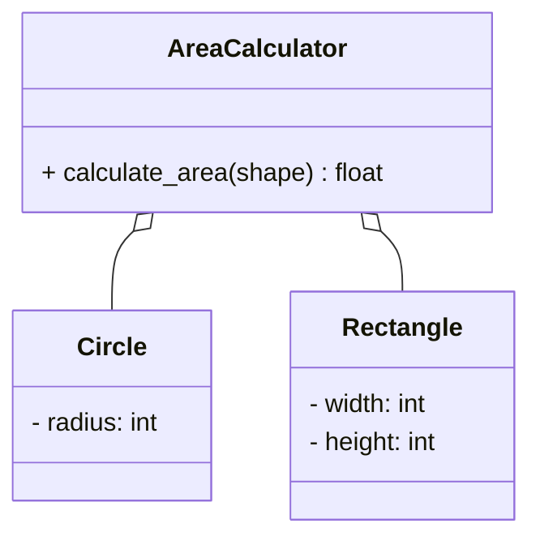
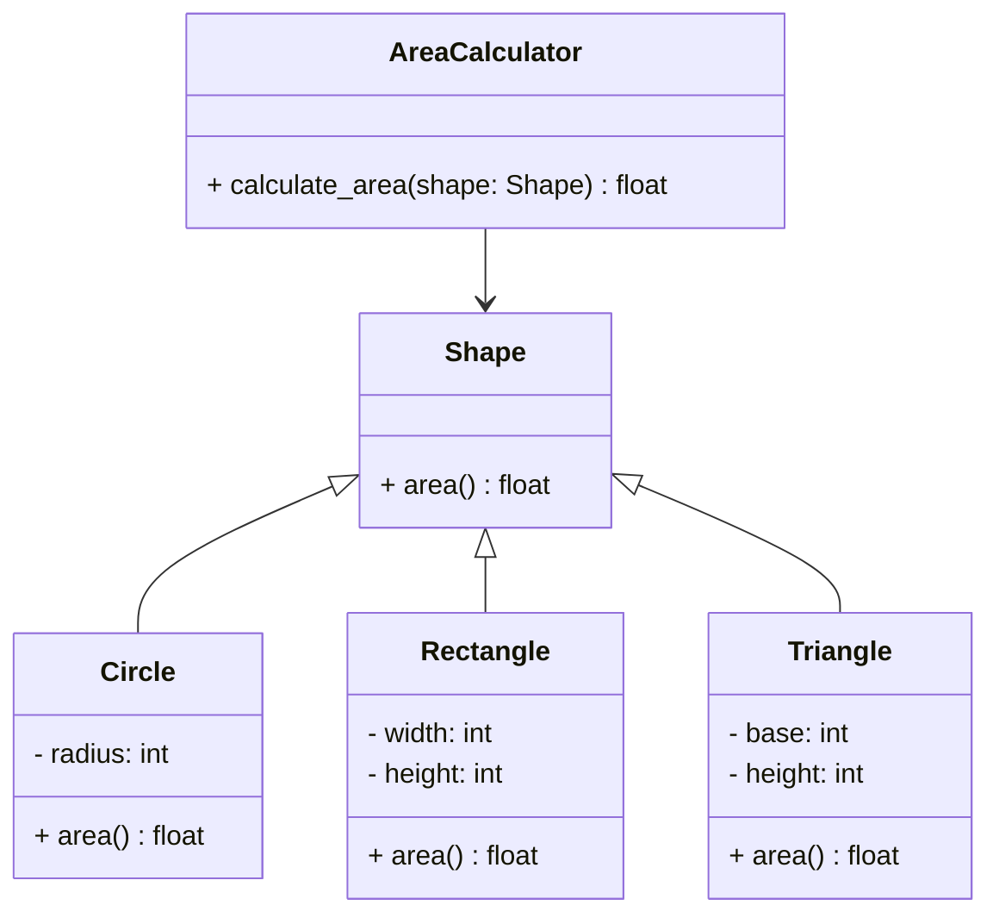

# Open-Closed Principle (OCP)


系統一旦完成，一個類的實現只應該因錯誤而修改，新的或者改變的特性應該通過新建不同的類實現。

1. 對擴展開放：可以新增功能
2. 對修改封閉：不應該修改現有的程式碼

## 違反 OCP 的問題

```python
class Circle:
    def __init__(self, radius):
        self.radius = radius

class Rectangle:
    def __init__(self, width, height):
        self.width = width
        self.height = height

class AreaCalculator:
    def calculate_area(self, shape):
        if isinstance(shape, Circle):
            return 3.14 * shape.radius ** 2
        elif isinstance(shape, Rectangle):
            return shape.width * shape.height
        # 如果再新增圖形，還需要修改這裡
```



1. AreaCalculator 類別中的 calculate_area 方法直接依賴 Circle 和 Rectangle，並包含了每個圖形的面積計算邏輯。
2. 如果新增一種新圖形（例如 Triangle），必須修改 AreaCalculator 類別的代碼來添加新圖形的計算邏輯，這違反了 OCP 原則。
3. 在這樣的設計中，AreaCalculator 會包含多個 if-else 或 type-check 語句來檢查並處理不同類型的圖形，因此無法做到對擴展開放、對修改封閉。

## 遵循 OCP 的改進

```python
from abc import ABC, abstractmethod

class Shape(ABC):
    @abstractmethod
    def area(self):
        pass

class Circle(Shape):
    def __init__(self, radius):
        self.radius = radius
    
    def area(self):
        return 3.14 * self.radius ** 2

class Rectangle(Shape):
    def __init__(self, width, height):
        self.width = width
        self.height = height
    
    def area(self):
        return self.width * self.height

class AreaCalculator:
    def calculate_area(self, shape: Shape):
        return shape.area()
```

```python
shapes = [Circle(5), Rectangle(4, 6)]
calculator = AreaCalculator()
for shape in shapes:
    print(f"Area: {calculator.calculate_area(shape)}")

```



1. Shape 是抽象基類，定義了 area() 方法。
2. Circle、Rectangle、和 Triangle 繼承 Shape 並實現各自的 area() 方法。
3. AreaCalculator 類別中的 calculate_area 方法依賴 Shape，實現了符合 Open-Closed Principle 的設計。

## 改進後的好處

1. 降低修改現有程式碼造成 bug 的風險
1. 程式碼更容易維護
1. 提高程式碼重用性
1. 更容易進行測試

### 實際應用場景

1. 當你開發一個圖形編輯器，需要支援不同形狀
1. 開發支付系統，需要支援多種支付方式
1. 遊戲開發中處理不同類型的角色
1. 報表系統中處理不同格式的輸出