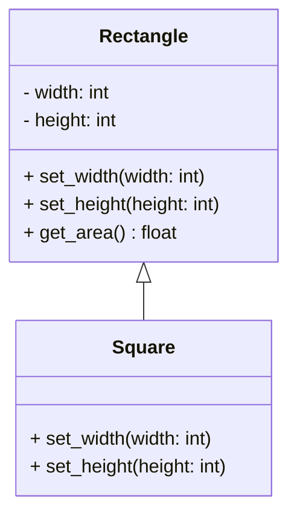
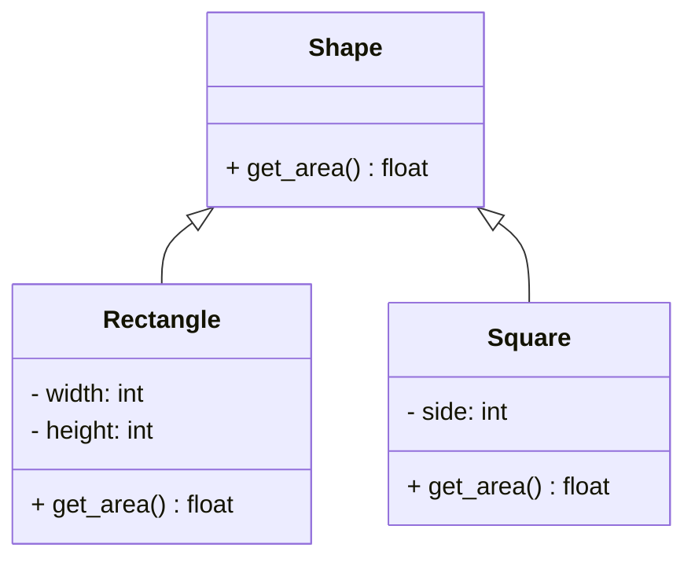

# Liskov Substitution Principle (LSP)

在軟體架構層中，我們會期待被同一群使用者所呼叫的介面都有著一樣的行為。

## 違反 LSP 的問題

```python
class Rectangle:
    def __init__(self, width, height):
        self.width = width
        self.height = height
    
    def set_width(self, width):
        self.width = width

    def set_height(self, height):
        self.height = height

    def get_area(self):
        return self.width * self.height


class Square(Rectangle):
    def set_width(self, width):
        self.width = width
        self.height = width  # 保持正方形的特性，設置相同寬高

    def set_height(self, height):
        self.width = height  # 保持正方形的特性，設置相同寬高
        self.height = height

# 測試違反 LSP 的行為
def calculate_area_of_rectangle(rect):
    rect.set_width(5)
    rect.set_height(10)
    return rect.get_area()


# 使用 Rectangle
rectangle = Rectangle(2, 3)
print("Rectangle Area:", calculate_area_of_rectangle(rectangle))  # Expected: 50

# 使用 Square 作為 Rectangle 的替代
square = Square(2, 2)
print("Square Area:", calculate_area_of_rectangle(square))  # Expected: 50, but result will be 25
```



### 分析
1. Rectangle 定義了 set_width 和 set_height 方法來設置寬和高，以及 get_area 方法來計算面積。
1. Square 繼承自 Rectangle，並覆寫了 set_width 和 set_height，使得寬和高必須相等，從而強制成為正方形。
1. 這種設計違反了 LSP，因為 Square 無法完全替代 Rectangle：在應用程式中用 Rectangle 預期的寬高獨立設置功能無法在 Square 中實現。

## 遵循 LSP 的改進

```python
from abc import ABC, abstractmethod

class Shape(ABC):
    @abstractmethod
    def get_area(self):
        pass

class Rectangle(Shape):
    def __init__(self, width, height):
        self.width = width
        self.height = height
    
    def get_area(self):
        return self.width * self.height

class Square(Shape):
    def __init__(self, side):
        self.side = side
    
    def get_area(self):
        return self.side * self.side
```

1. Shape 是抽象基類，定義了 get_area() 方法，強制子類別提供面積計算方法。
1. Rectangle 和 Square 繼承 Shape，並各自實現自己的 get_area() 方法。
1. Rectangle 和 Square 之間沒有彼此依賴的行為，可以獨立使用，符合 LSP。



## 改進後的好處