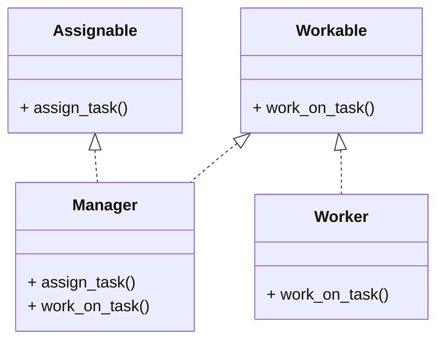

# Interface Segregation Principle (ISP)

模組與模組之間的依賴，不應有用不到的功能可以被對方呼叫

假設我們在開發一個多功能的工作系統，其中不同的員工角色有不同的職責。假設這個系統裡包含 Manager 和 Worker 兩種角色：

Manager 可以分配任務和報告進度。
Worker 可以完成任務。

## 違反 ISP 的問題

```python
class Employee:
    def assign_task(self):
        pass

    def work_on_task(self):
        pass

class Manager(Employee):
    def assign_task(self):
        print("Manager is assigning a task.")
    
    def work_on_task(self):
        print("Manager is working on the task.")

class Worker(Employee):
    def assign_task(self):
        # Worker 不需要分配任務，這裡會是冗餘方法
        pass
    
    def work_on_task(self):
        print("Worker is working on the task.")
```

## 遵循 ISP 的改進

```python
from abc import ABC, abstractmethod

class Assignable(ABC):
    @abstractmethod
    def assign_task(self):
        pass

class Workable(ABC):
    @abstractmethod
    def work_on_task(self):
        pass

class Manager(Assignable, Workable):
    def assign_task(self):
        print("Manager is assigning a task.")
    
    def work_on_task(self):
        print("Manager is working on the task.")

class Worker(Workable):
    def work_on_task(self):
        print("Worker is working on the task.")
```



## 改進後的好處

Assignable 介面只定義了 assign_task() 方法，適合用於需要分配任務的類別。

Workable 介面只定義了 work_on_task() 方法，適合用於需要工作的類別。

Manager 實現了 Assignable 和 Workable，因此具有分配任務和執行工作的能力。

Worker 只實現了 Workable，所以它只負責工作，沒有 assign_task() 方法，符合 ISP 的設計。