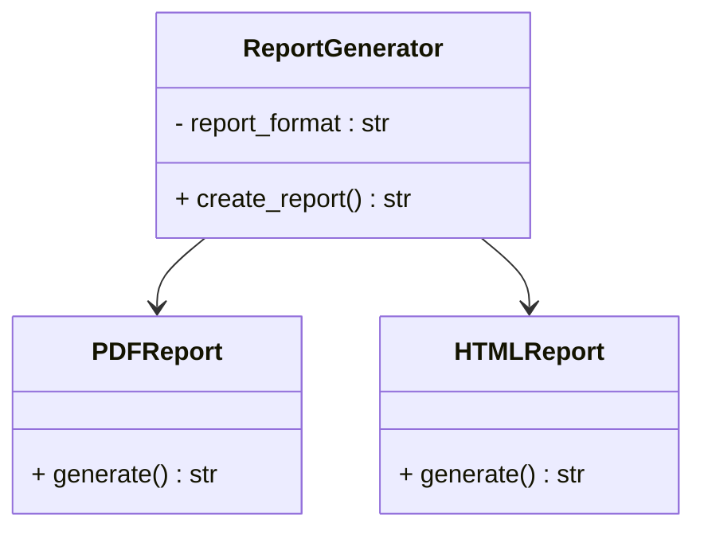
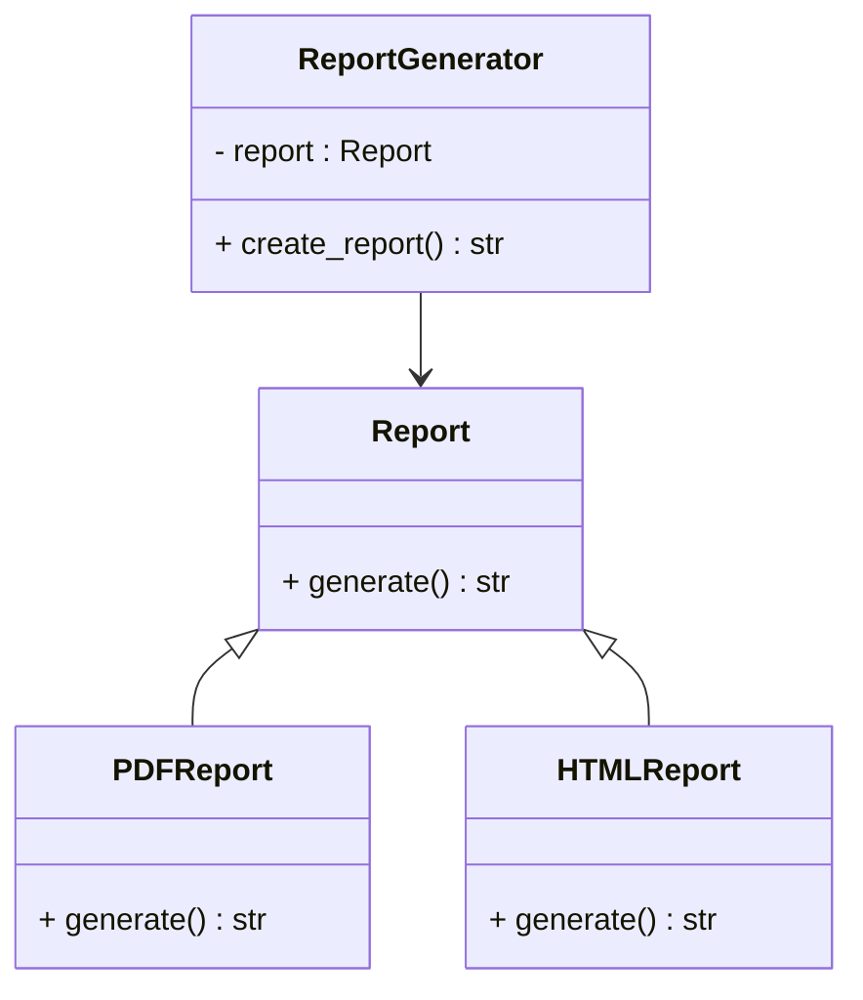

# Dependency Inversion Principl (DIP)

定義：高層模組不應依賴低層模組，它們都應依賴於抽象介面。抽象介面不應該依賴於具體實作，具體實作應依賴抽象介面。

什麼是高層模組，什麼是低層模組？

低層模組：該模組的實現都是不可分割的原子邏輯層，如 MVC 中的 Model 層。

高層模組：該模組的業務邏輯多是由低層模組組合而成，如 MVC 中的 Controller 層與 Client 端。

## 違反 DIP 的問題

```python
class PDFReport:
    def generate(self):
        return "Generating PDF report."

class HTMLReport:
    def generate(self):
        return "Generating HTML report."

class ReportGenerator:
    def __init__(self, report_format):
        self.report_format = report_format

    def create_report(self):
        if self.report_format == "PDF":
            pdf_report = PDFReport()
            return pdf_report.generate()
        elif self.report_format == "HTML":
            html_report = HTMLReport()
            return html_report.generate()
```



### 分析

ReportGenerator 直接依賴具體的 PDFReport 和 HTMLReport 類別，每次新增報告格式都需要改動 ReportGenerator，導致高耦合。


## 遵循 DIP 的改進

```python
from abc import ABC, abstractmethod

class Report(ABC):
    @abstractmethod
    def generate(self):
        pass

class PDFReport(Report):
    def generate(self):
        return "Generating PDF report."

class HTMLReport(Report):
    def generate(self):
        return "Generating HTML report."

class ReportGenerator:
    def __init__(self, report: Report):
        self.report = report

    def create_report(self):
        return self.report.generate()
```



### 分析

ReportGenerator 依賴於抽象的 Report 介面，而不是具體類別。新增報告格式時，無需修改 ReportGenerator，只需創建新的 Report 實現類別即可。

符合 DIP 的設計增加了系統的靈活性和可擴展性，減少了類別間的耦合。